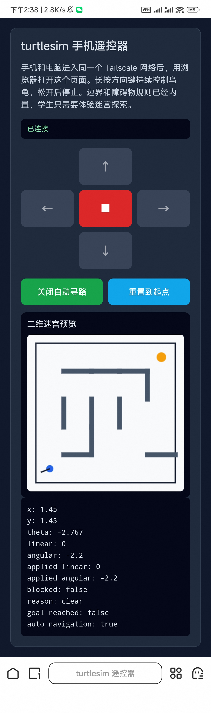

# ROS2 turtlesim 遥控迷宫起始代码

这一套代码用于第 14 周项目的 2D 版本：

- 手机作为控制手柄
- `Tailscale` 负责手机和电脑之间的网络通信
- `ROS2 turtlesim` 负责二维乌龟运动
- 二维迷宫的边界和障碍物规则已经内置

## 目录

```text
turtlesim_remote/
├── turtlesim_web_bridge.py
├── index.html
└── requirements.txt
```

## 依赖说明

这一套代码默认你已经有可用的 `ROS2 Humble` 与 `turtlesim`。

额外安装网页桥接依赖：

```bash
pip install -r requirements.txt
```

## 启动方式

### 1. 启动 turtlesim

```bash
source /opt/ros/humble/setup.bash
ros2 run turtlesim turtlesim_node
```

### 2. 启动网页桥接程序

新开一个终端：

```bash
source /opt/ros/humble/setup.bash
python3 turtlesim_web_bridge.py
```

默认监听地址：

```text
http://0.0.0.0:8080
```

### 3. 手机打开遥控器页面

手机和电脑进入同一个 `Tailscale` 网络后，在手机浏览器中打开：

```text
http://<WSL的Tailscale_IP>:8080
```

## 代码分工

- `turtlesim_web_bridge.py`
  - 作为 ROS2 节点发布 `/turtle1/cmd_vel`
  - 订阅 `/turtle1/pose`
  - 内置二维迷宫的边界、障碍物和阻挡规则
  - 提供重置到起点的控制接口
  - 同时提供网页和 `WebSocket` 接口
- `index.html`
  - 提供手机方向控制页面
  - 显示二维迷宫预览、起点、终点和当前乌龟位置
  - 发送前进、后退、左转、右转、停止命令

## 运行时的协调方式

这一套 starter 的运行顺序很固定：

1. `turtlesim_node` 先运行
2. `turtlesim_web_bridge.py` 持续运行
3. 手机网页连接后发送控制命令

桥接程序关闭后，手机网页虽然还能打开，但不会再有程序把控制命令发布到 ROS2。

## 已内置的迷宫规则

1. 迷宫边界
2. 障碍物矩形区域
3. 运动前的碰撞预测
4. 障碍物阻挡时自动禁止继续前进/后退
5. 起点与终点区域

## 学生主要体验内容

1. 用手机网页遥控乌龟
2. 观察边界和障碍物规则如何生效
3. 尝试从起点走到终点
4. 如果有余力，再记录路线或扩展控制方式
